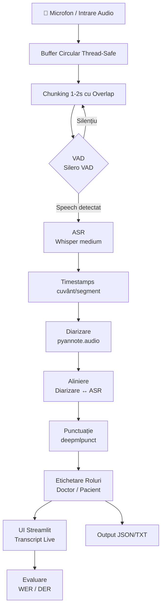
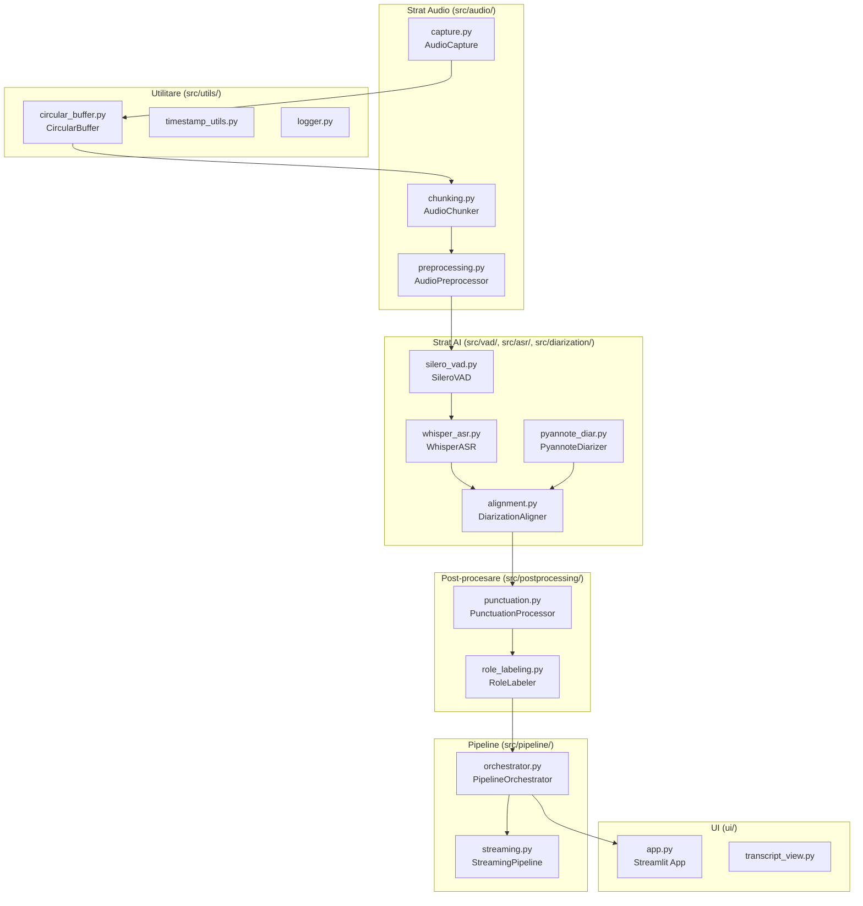
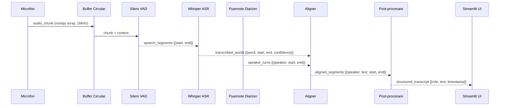
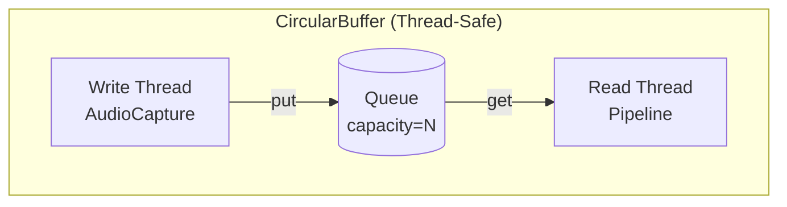
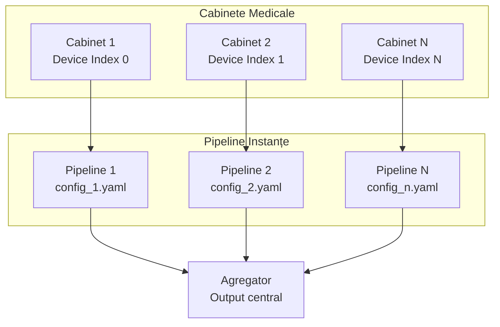

# Arhitectura Sistemului Diagnostic Assistant

## Prezentare Generală

Diagnostic Assistant implementează un pipeline în timp real de 10 pași pentru transcrierea și analiza consultațiilor medicale audio.

## Diagrama Pipeline-ului Principal

## Diagrama Componentelor

## Diagrama Fluxului de Date

## Arhitectura Buffer-ului Circular

## Scalabilitate

Arhitectura suportă 2–200 cabinete fără modificări:

## Detalii Tehnice

### Fereastra Sliding pentru Diarizare
- Fereastră: 20 secunde
- Pas: 10 secunde (50% overlap)
- Asigură continuitate în identificarea vorbitorului

### Alinierea Timestamp-urilor
- ASR produce timestamps la nivel de cuvânt
- Diarizarea produce intervale per vorbitor
- Alinierea folosește intersecția intervalelor (overlap maxim)

### Thread Safety
- `CircularBuffer` folosește `threading.Lock` și `queue.Queue`
- Producătorul (AudioCapture) și consumatorul (Pipeline) rulează în thread-uri separate
